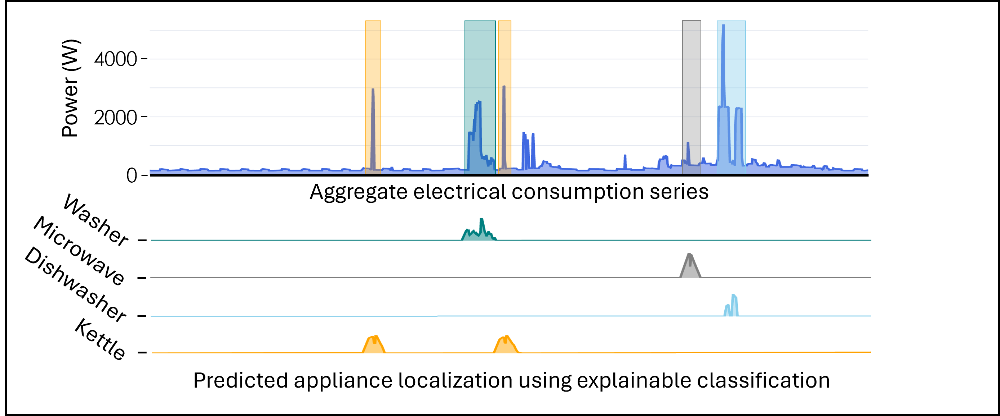
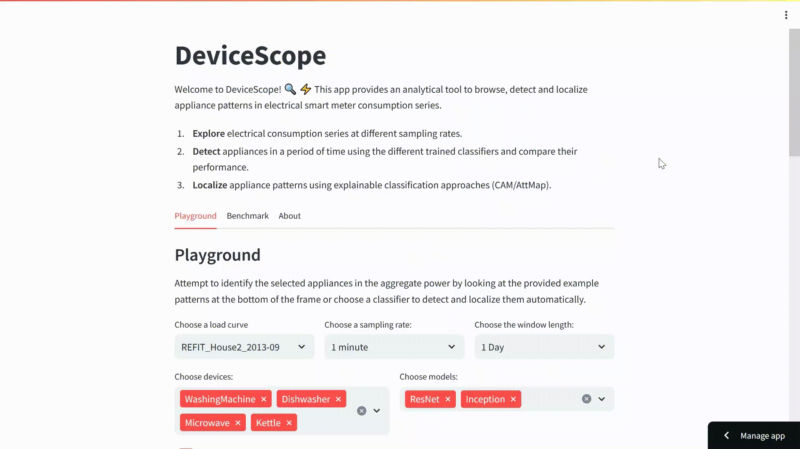

<p align="center">

</p>
<h1 align="center">DeviceScope</h1>

<h2 align="center">An interactive tool to browse, detect and localize appliance patterns in electricity consumption time series</h2>

<div align="center">
<p>
 
</p>
</div>

<p align="center"><a href="https://devicescope.streamlit.app/">Try our demo</a></p>
<p align="center">

</p>


DeviceScope is a Python web interactive application that facilitates the understanding of aggregate smart meter data (i.e., time series of electricity consumption).
It enables the detection and localization of individual appliance patterns within a given time period using a weakly supervised approach: the solutions used inside our system required only the knowledge of the existence of an appliance in a household to be trained.
This substantially reduces the number of labels needed and, therefore, the manual effort required, as it obviates the need to monitor each appliance in a house with a specific meter to obtain ground-truth individual appliance data.


## Contributors

* [Adrien Petralia](https://adrienpetralia.github.io/), EDF R&D, Université Paris Cité
* [Paul Boniol](https://boniolp.github.io/), Inria, ENS, PSL University, CNRS
* [Philippe Charpentier](https://www.researchgate.net/profile/Philippe-Charpentier), EDF R&D
* [Themis Palpanas](https://helios2.mi.parisdescartes.fr/~themisp/), Université Paris Cité, IUF

## Usage

**Step 1:** Clone this repository using `git` and change into its root directory.

```(bash)
git clone https://github.com/adrienpetralia/devicescope.git
cd devicescope/
```

**Step 2:** Create and activate a `conda` environment and install the dependencies.

```(bash)
conda create -n devicescope python=3.8
conda activate devicescope
pip install -r requirements.txt
```

**Step 3:** You can use our tool in two different ways: 

- Access online: https://devicescope.streamlit.app/
- Run locally (preferable for faster interaction). To do so, run the following command:

```(bash)
streamlit run Hello.py
```

## Acknowledgments

Work supported by EDF R&D and ANRT French program.
